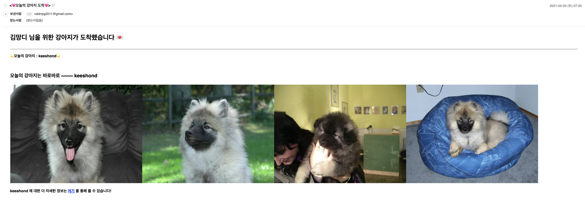

[![Made by][seosang-icon]][seosang-url]
[![MIT License][license-shield]][license-url]
[![Python-version][python-icon]][python-url]

<br />
<p align="center">
  <a href="https://github.com/othneildrew/Best-README-Template">
    
  </a>

  <h3 align="center">Mail-Dog🐶</h3>

  <p align="center">
    Send a picture of a cute dog by random to your friend every day. 💌
    <br />
    <!-- <a href="https://github.com/othneildrew/Best-README-Template"><strong>Explore the docs »</strong></a> -->
    <br />
    <br />
    <a href="#demo">View Demo</a>
    ·
    <a href="#getting-started">Getting Started</a>
    ·
    <a href="#contact">Author</a>
  </p>
</p>

# Table of Contents

- [Table of Contents](#table-of-contents)
  - [About The Project](#about-the-project)
    - [Reference](#reference)
    - [Demo](#demo)
  - [Getting Started](#getting-started)
    - [Prerequisites](#prerequisites)
    - [Installation](#installation)
  - [Usage](#usage)
  - [Contributing](#contributing)
  - [License](#license)
  - [Contact](#contact)

<!-- ABOUT THE PROJECT -->

## About The Project

Fetch a cute dog images, and send email to your friends automatically.

It is a simple program made by an individual alone.

### Reference

- api : [dog-api](https://dog.ceo/dog-api/)
- mail : [gmail-IMAP](https://support.google.com/a/answer/12103?hl=ko)
- about python : [python-document](https://docs.python.org/3/)

### Demo



An email that looks like this will be sent to the target email address !

<!-- GETTING STARTED -->

## Getting Started

### Prerequisites

- Install python
- Email IMAP preferences
  - [See here](https://support.google.com/mail/answer/7126229?hl=en)

> If you want to execute everyday automatically, recommends running on Linux or Mac OS.

### Installation

1. Please make sure you meet Prerequisites.
2. Clone the repo
   ```sh
   $ git clone https://github.com/SeoSang/maildog.git
   $ cd maildog
   ```
3. Install requirements
   ```sh
   $ cd src
   $ pip install -r requirements.txt
   ```
4. Edit configuration `src/conf`

   `conf.json`

   ```json
   {
     "my_email": "myeamil@naver.com",
     "password": "email_password",
     "target_emails": ["email1@naver.com", "email2@naver.com"],
     "target_name": "Friends_name"
   }
   ```

   `content.json`

   ```json
   {
     "text": [
       "안녕하세요!, 저는 %s 입니다!",
       "멍멍!! - %s",
       "오늘의 댕댕이 %s 를 소개합니다!",
       "바우와우 ! 바우와우 ! - %s",
       "반가워~ 나는 %s 야!",
       "오늘의 강아지는 바로바로 ~~~~ %s",
       "오늘밤 주인공은 나야 나! - %s",
       "%s 가 당신에게 말을 걸어요! (멍멍!)",
       "강아지를 사랑하는 당신에게 ... %s 를 보냅니다.",
       "%s 의 러브레터 도착!"
     ],
     "target_name": "김망디",
     "breed_to_exclude": ["cotondetulear"],
     "breed_to_select": [],
     "img_cnt": 4
   }
   ```

- `%s` will be put a breed of dog images.
- `breed_to_exclude` : The breed that you don't want to mail.
- `breed_to_select` : If you want to send only certain breeds, activate this option. If it is [], this option will be disabled.

<!-- USAGE EXAMPLES -->

## Usage

- Send email by random breed once
  - `random.sh`
    ```sh
    $ python3 maildog.py random
    ```
- Send email by random breed once
  - `breed.sh`
    ```sh
    $ python3 maildog.py breed <breed_name> <img_cnt>
    ```
- Send email by random breed at particular time everyday.
  - `run_everyday.sh`
    ```sh
    $ python3 maildog.py run_everyday 22:30
    ```
  - To run by daemon on linux
    ```sh
    $ nohup ./run_everyday.sh &
    ```
    > Warning : The time will be on the device you run.

## Contributing

Contributions are what make the open source community such an amazing place to be learn, inspire, and create. Any contributions you make are **greatly appreciated**.

1. Fork the Project
2. Create your Feature Branch (`git checkout -b feature/AmazingFeature`)
3. Commit your Changes (`git commit -m 'Add some AmazingFeature'`)
4. Push to the Branch (`git push origin feature/AmazingFeature`)
5. Open a Pull Request

<!-- LICENSE -->

## License

Distributed under the MIT License.

<!-- CONTACT -->

## Contact

SeoSang

- Blog : https://programming119.tistory.com
- Site : https://i-am-seo-sang.vercel.app/
- Email : ddrrpg@naver.com

[seosang-icon]: https://img.shields.io/static/v1?label=madeby&message=seosang&color=blue
[seosang-url]: https://github.com/SeoSang
[license-shield]: https://img.shields.io/github/license/othneildrew/Best-README-Template.svg
[license-url]: #license
[python-icon]: https://img.shields.io/static/v1?label=python&message=>=3.6&color=yellow
[python-url]: https://docs.python.org/3/
